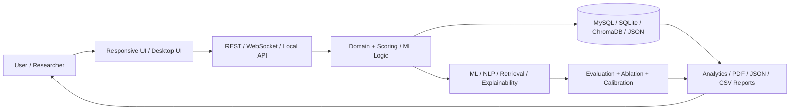

<!--
  GitHub Profile README for Tahmid Ahmed Talukder (@tahmidd01)
  Built around three source layers:
  1) CV / academic + research record
  2) public GitHub repositories
  3) portfolio identity + visual language

  Place this file at the root of the public repository:
  https://github.com/tahmidd01/tahmidd01
-->

<p align="center">
  
</p>

<p align="center">
  <a href="https://git.io/typing-svg">
    
  </a>
</p>

<h1 align="center">Tahmid Ahmed Talukder</h1>

<p align="center">
  <strong>Research-driven software engineer building explainable AI, full-stack systems, and local-first products.</strong>
</p>

<p align="center">
  Final-year CSE undergraduate at <strong>United International University</strong>, published co-author, and product-minded developer working across
  <strong>AI/ML research, backend/API architecture, bioinformatics, Green AI, real-time systems, and human-centered design</strong>.
  I care about reproducibility, explainability, privacy, and polished UX as much as raw model performance.
</p>

<p align="center">
  <a href="https://tahmidd01.github.io/tahmidd01/">
    
  </a>
  <a href="https://github.com/tahmidd01">
    
  </a>
  <a href="https://linkedin.com/in/tahmid-ahmed-talukder-417712285">
    
  </a>
  <a href="mailto:tahmidahmed789456@gmail.com">
    
  </a>
</p>

---

## 🧭 About Me — The Matrix

| | |
|---|---|
| 🎓 **Academic** | Final-year **BSc in Computer Science & Engineering** at United International University, Dhaka — coursework spanning Machine Learning, Data Mining, HCI, Advanced OOP, and Software Engineering. |
| 🧠 **Research** | Neuro-symbolic multimodal mental-health AI, hypergraph learning for higher-order drug interactions, computational genomics / CNV detection, Green AI benchmarking, explainability, and human-centered computing. |
| 🏗️ **Building** | AI-enabled web platforms, REST APIs, real-time collaboration, local-first systems, interactive 3D dashboards, desktop applications, research tooling, and reproducible experimental pipelines. |
| 🔬 **Deepening** | Explainable ML, efficient model training, research reproducibility, robust API architecture, privacy-aware software, calibrated evaluation, and higher-order graph learning. |
| 🤝 **How I work** | Comfortable owning products end-to-end and collaborating in multi-person research/HCI teams — from user interviews and system architecture to implementation, evaluation, documentation, and demos. |
| ⚡ **Personal checksum** | I like my APIs **RESTful**, my experiments **reproducible**, and my 3D graphs **explainable**. |

> **Engineering thesis:** a strong system should not only work — it should make its data flow, uncertainty, trade-offs, and user impact understandable.

---

## 🧬 Skill Ecosystem

### Languages & Core Web

<p>
  
  
  
  
  
  
  
  
  
</p>

### Backend, APIs & Real-Time Systems

<p>
  
  
  
  
  
  
  
  
  
  
  
  
</p>

### AI, Machine Learning & Explainability

<p>
  
  
  
  
  
  
  
  
  
  
  
  
  
  
  
  
  
  
  
</p>

### Bioinformatics & Computational Research

<p>
  
  
  
  
  
  
  
  
  
  
</p>

### Data, Storage & Retrieval

<p>
  
  
  
  
  
  
  
</p>

### Frontend, Desktop, Visualization & UX

<p>
  
  
  
  
  
  
  
  
  
  
  
</p>

### Green AI, Evaluation & Experimental Practice

<p>
  
  
  
  
  
  
  
  
  
</p>

### Engineering Tooling & Architecture

<p>
  
  
  
  
  
  
  
  
  
  
  
  
  
  
</p>

### Collaboration & Research Practice

<p>
  
  
  
  
  
  
  
</p>

---

## 🏛️ Featured Architecture & Projects

| Project | Why it matters | Stack / architecture |
|---|---|---|
| **[Cognisense](https://tahmidd01.github.io/tahmidd01/#projects)** | Full-stack AI skill-assessment platform spanning **voice, video, and text**, hybrid semantic/NLI scoring, transcription, RAG, real-time collaboration, RBAC, notifications, and generated CV/certificate PDFs. | `Laravel 11` `FastAPI` `MySQL` `ChromaDB` `SBERT` `faster-whisper` `FFmpeg` `WebSockets` |
| **[Friction by Design](https://github.com/tahmidd01/Friction-by-Design-A-Systematic-Audit-of-Dark-Patterns-in-Account-Security-Hardening-Flows)** | Research-grade platform for a systematic audit of account-security hardening flows, with deterministic sampling, append-only human decisions, privacy-safe evidence workflows, reproducible releases, CLI tooling, QA, and **157-test** validation at the recorded checkpoint. | `Python 3.12` `SQLite` `CLI` `unittest` `research pipelines` `reproducibility` `privacy/governance` |
| **[Verity OS](https://github.com/tahmidd01/verity_os)** | Local-first “reality integrity” system that gives claims provenance passports, tracks contradiction/freshness/evidence, and places a **Decision Firewall** between weak information and high-impact decisions. | `PHP` `Vanilla JS` `JSON persistence` `Canvas 3D` `PWA` `local-first` |
| **[Neuro-Symbolic Multimodal AI](https://tahmidd01.github.io/tahmidd01/#research)** | Interpretable depression-screening research fusing **Wav2Vec2 + MentalRoBERTa** through a 15-concept bottleneck; includes LLM concept annotation, ablations, sensitivity analysis, and proxy anxiety indicators. | `Python` `PyTorch` `Transformers` `MentalRoBERTa` `Wav2Vec2` `concept bottlenecks` |

### Selected research result
The neuro-symbolic system's recorded test results were **RMSE 5.53**, **MAE 4.03**, **macro-F1 0.64**, and **PR-AUC 0.69** across **56 E-DAIC test sessions**.

---

## 🛰️ More Systems & Research

| Project | Signal |
|---|---|
| **[Green AI Benchmark](https://github.com/tahmidd01/green-bench)** | Controlled PyTorch-vs-TensorFlow neural-network efficiency benchmarking using CIFAR-10 and CodeCarbon; pilot recorded lower runtime, tracked energy, and estimated emissions for the PyTorch run while explicitly avoiding universal framework claims. |
| **[CASH-HyperLBS](https://github.com/tahmidd01/cash_hyperlbs)** | Signed-ambiguous hypergraph framework for higher-order adverse drug-event detection using HODDI/FAERS, SapBERT harmonization, multi-channel message passing, structural-frustration estimation, contrastive pretraining, and confidence-weighted LLM distillation. |
| **PScnv-PoNMatch** | Computational-genomics framework for confidence-aware CNV detection in unmatched targeted sequencing; benchmarked against XHMM, CNVkit, CODEX2, and standard PScnv across 75 simulated multi-cancer profiles. |
| **[MeshPulse 3D](https://github.com/tahmidd01/MeshPulse_3D)** | Local observability + chaos-engineering command center for microservice / AI-agent graphs, telemetry, traces, topology ingestion, failure injection, and live Three.js network visualization. |
| **[Continuum OS](https://github.com/tahmidd01/continuum_os)** | Local-first restart OS for interrupted work: Resume Capsules, deterministic re-entry ranking, Focus Tunnel, Decision Vault, Promise Radar, 3D orbit visualization, PWA shell, and portable JSON data. |
| **[TrustMesh](https://github.com/tahmidd01/TrustMesh)** | Explainable local scam/social-engineering risk analysis with Flask + SQLite, a 0–100 evidence-oriented scoring model, interactive 3D signal mesh, case vault, exports, analytics, and a REST API. |
| **[ArcadiaFX](https://github.com/tahmidd01/ArcadiaFX)** | Modular JavaFX gaming hub with 20 functional games, MySQL persistence, SHA-512 authentication, WebSocket chat, AI-assisted discovery, reporting, lazy loading, caching, and background processing. |
| **[AspireIELTS](https://github.com/tahmidd01/AspireIELTS)** | Full IELTS learning + assessment system with timed mock tests, automatic scoring, GPT/OpenRouter writing feedback, Jitsi speaking assessments, analytics, certificates, admin workflows, and application support. |
| **[DormPilot](https://github.com/tahmidd01/DormPilot)** | Role-based hostel operations platform for admissions, rooms, complaints, supervisors, tasks, announcements, messaging, operational analytics, and PDF reporting. |
| **[EdAcademix](https://github.com/tahmidd01/EdAcademix)** | Education-guidance platform with country-based university discovery, database-backed requirements/eligibility, AI assistance, offer-letter workflows, and secure application handling. |

---

## 🔬 Research Lens

```text
                         ┌────────────────────────────┐
                         │  Responsible AI Systems    │
                         └─────────────┬──────────────┘
                                       │
             ┌─────────────────────────┼─────────────────────────┐
             │                         │                         │
             ▼                         ▼                         ▼
   Explainability              Efficiency / Green AI      Human-Centered Design
   • concept bottlenecks       • energy measurement       • interviews
   • attributions             • framework parity         • think-aloud testing
   • calibrated outputs       • runtime / power / CO₂    • trust + accessibility
             │                         │                         │
             └─────────────────────────┼─────────────────────────┘
                                       ▼
                          Reproducible Engineering
                          • explicit assumptions
                          • controlled experiments
                          • deterministic pipelines
                          • honest claim boundaries
```

**Research themes:** multimodal mental health · neuro-symbolic AI · graph / hypergraph learning · adverse drug-event modeling · computational genomics · Green AI · explainable systems · reproducibility · HCI.

---

## 🧪 Practical Engineering Habits

- **Build end-to-end:** UI → API → persistence → model/service layer → evaluation → documentation.
- **Prefer explainability over magic:** deterministic logic and interpretable signals where a black-box prediction is not justified.
- **Treat experiments like software:** controlled variables, parity checks, ablations, metrics, validation, and explicit limitations.
- **Design for local-first/privacy-aware operation** when cloud dependence is unnecessary.
- **Use 3D/visualization with purpose:** to expose architecture, relationships, dependencies, or risk — not just decoration.
- **Document boundaries:** implemented vs planned, measured vs inferred, research data vs demo data.
- **Care about the human layer:** user research, usability testing, accessibility-minded motion controls, and low-friction workflows.

---

## 📐 Architecture Patterns I Keep Reusing



---

## 🏆 Recognition, Publication & Academic Signal

<p>
  
  
  
</p>

- 🥈 **First Runner-Up — Advanced Object-Oriented Programming**, UIU CSE Project Show, for **ArcadiaFX**
- 🔟 **Top 10 — Software Engineering Lab**, UIU CSE Project Show, for **Cognisense**
- 📄 Co-author — **“Quantum Computing Applications in High-Speed Signal Processing for EEE Systems”**, *International Journal of Engineering, Business and Management*, 2024 — [DOI: 10.22161/ijebm.8.4.7](https://doi.org/10.22161/ijebm.8.4.7)
- 🎓 **BSc in Computer Science & Engineering**, United International University — 2022–2026
- 🌐 Languages: **English (C1)** · **Bengali (C1)** · **Arabic (A2)**

---

## 📊 GitHub Analytics

<p align="center">
  
  
</p>

<p align="center">
  
</p>

<p align="center">
  
</p>
## 🤝 Connection Hub

<p align="center">
  <a href="https://linkedin.com/in/tahmid-ahmed-talukder-417712285">
    
  </a>
  <a href="https://tahmidd01.github.io/tahmidd01/">
    
  </a>
  <a href="mailto:tahmidahmed789456@gmail.com">
    
  </a>
</p>

<p align="center">
  <strong>Interested in software engineering, AI/ML engineering, research engineering, developer tooling, and human-centered intelligent systems.</strong>
</p>

<p align="center">
  <code>build → measure → explain → refine</code>
</p>
